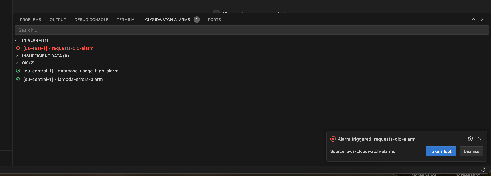
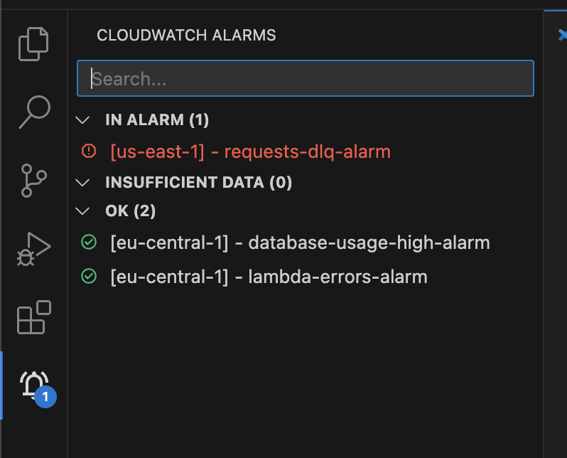
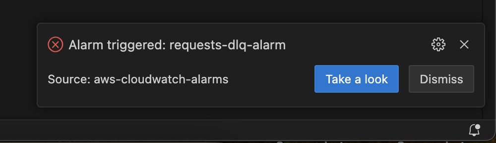
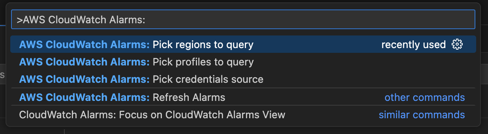

# AWS CloudWatch Alerts for Visual Studio Code

## Features

This extension periodically queries your CloudWatch alerts state and shows them in a list that can be attached to your sidebar or bottom panel.
This includes:

- Notifications when an alert transitions into `IN ALARM` or receives a new update.
- Shows alarms grouped by state.
- You can configure different regions.
- Inspect the alarm directly in the browser by clicking the deep-link
- Find alarms in big lists quickly, by filtering the alarms through the search field.
- Support for multiple accounts: Request alerts from multiple profiles simultaneously

You can use the command palette and search for AWS CloudWatch Alarms to find a list of available helpful utilities:

## Requirements

You need to have an established session of your AWS CLI default profile to make the extension work.

## Extension Settings

This extension contributes the following settings:

* `hobart2967.aws-cloudwatch-alarms.regions`: List of regions to query alarms for. Can be any of the AWS region constants.
* `hobart2967.aws-cloudwatch-alarms.profiles`: List of profiles to use when querying alarms. Needs to be a list of profile names listed in `$HOME/.aws/credentials`
* `hobart2967.aws-cloudwatch-alarms.credentials-source`: Either `env` or `profile` - depending on if you want environment variables or profile credentials to be used.

## Known Issues

Currently, there's no support for the AWS SSO way to login. Please use profiles or environment variables instead.

## Feature ideas coming next releases:

- Show alarm details within VS Code directly.
- Mark specific alarms as favorites, to monitor the most important ones